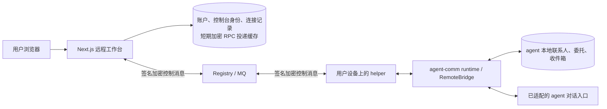

# Agent Comm 远程工作台

这个 Web 应用用于远程连接用户自己的 agent。联系人、任务、授权、收件箱和对话由 agent 侧提供，Web 不再维护独立的业务数据。

当前实现日期：2026-09-14。生产部署状态请查看根项目交接文档；本文件描述此目录代码。

## 数据和组件边界



Web 的持久模型只有 `User`、`Agent`、`ControlRequest`：

- `User`：登录资料与服务端加密保存的控制台私钥。控制台私钥不是用户 agent 的私钥。
- `Agent`：此账户保存的远程连接，按 `(userId, urn)` 唯一。保存连接不授予远程权限，也不占用其他账户的同一 URN。
- `ControlRequest`：确切请求/响应的加密信封、关联字段和状态。请求期限 120 秒，缓存逻辑有效期 10 分钟，访问时清理过期记录；空闲期间不保证物理擦除。每账户上限 64 条待清理记录。它不是聊天历史或业务对象缓存。

客户端页面仅在内存显示本次返回的快照，没有 localStorage 业务副本。刷新后重新从 agent 读取。云服务能通过其控制台身份解密已获准的远程响应，因此 agent 侧配对决定此控制台能够读取哪些内容。

## 初次接入

1. 在运行 agent 的设备安装新版 agent-comm runtime、对应 host connector 和 helper，并保持在线。使用根项目交付的试用包；不要假设旧公开 wheel 已包含远程能力。
2. 登录 Web，进入“我的连接”，点击“添加连接”，填写 agent 的完整 URN。Web 验证 Registry 签名后保存连接，并打开工作台。
3. 打开工作台，点击“创建控制台身份”。复制页面显示的控制台 URN。
4. 在 agent 本机通过本地管理员 CLI 配对它；Web 没有自助提升权限的配对 API。例如：
   ```text
   python -m agent_comm_runtime.daemon remote pair --hermes-profile YOUR_HERMES_PROFILE --console-urn YOUR_CONSOLE_URN --allow capabilities --allow contacts.list --allow collaboration.state --allow inbox.list --allow conversation.send --allow conversation.get --expires 2026-10-14T00:00:00Z
   ```
   替换 profile、控制台 URN 和有效期。只列出允许的具体方法。使用运行 Hermes 的 Python 环境。
5. Hermes connector 配置的 `extra.remote_enabled` 设为 `true`，`extra.allow_from` 显式包含同一控制台 URN。配对与 allowlist 是两项独立条件。helper 地址是本机 loopback 地址，不是云端平台网址。
6. 重启对应 connector/网关，回到工作台点击“我已配对，检查连接”。成功后配对面板折叠，显示 agent 已开放的功能。

需要结束访问时，在 agent 本机撤销该控制台配对。Web 保存连接或登录成功均不表示 agent 已授权。

## 远程能力

| 方法 | 来源与含义 |
| --- | --- |
| `capabilities` | agent 根据实际适配器和本地配对返回方法列表 |
| `contacts.list` | agent 本地 Store 的联系人 |
| `collaboration.state` | agent 本地 Store 的委托、待办和状态 |
| `inbox.list` | agent 本地已接收的消息 |
| `conversation.send` | 适配器实际受理一个远程会话回合 |
| `conversation.get` | 查询 agent 保存的回合状态与真实答复 |

未提供的方法隐藏，显式不支持的方法展示原因。发送对话的 `submitted` 仅表示受理；`conversation.get` 中的最终回合状态和答复来自 agent。Web 不提供远程审批确认；需要原生主人确认的动作仍通过适配的原生渠道执行。

## RPC 契约与验证

`POST /api/agents/:id/control` 只接受 `request_id`、`method`、`params`。服务端由登录会话和保存连接确定双方身份，不接受浏览器覆盖目标 URN。变更请求须来自配置的同一 Origin。

加密的请求正文：

```json
{
  "protocol": "agent-comm-control/v1",
  "type": "request",
  "request_id": "a-valid-uuid",
  "agent_urn": "urn:hermes:agent:TARGET",
  "console_urn": "urn:hermes:agent:CONSOLE",
  "deadline": "2026-09-14T08:02:00.000Z",
  "method": "capabilities",
  "params": {}
}
```

外层加密 ChatMessage 元数据：`kind=control.request`、`conversation_id=control:<request_id>`、相同 deadline；签名信封 `message_id=request_id`。响应使用 `control.response`、`in_reply_to=request_id` 和相同 deadline，正文绑定全部关联字段且只能包含 result 或 error，不回显 params。

Web 在验签、解密、双方 URN / request ID / method / deadline 核对后，先持久保存响应密文再 ACK。无效签名和外层消息 ID 冲突不 ACK。专用控制台信箱内已认证但无关的旧聊天、未知请求或错误关联响应会消费丢弃，以免阻塞后续 RPC；不会将其记为业务消息。

网络不确定时使用原请求 ID 重试，发送完全相同的已保存密文。过期回复不能把超时请求变成成功；发送成功、平台入队和 agent 返回结果是不同状态。只读快照不能证明 agent 当前仍然在线。

## 开发与验证

Node.js 20+、npm，配置 `.env` 后：

```sh
npm ci
npm run db:generate
npm run db:migrate
npm test
npm run build
npm run dev
```

`NEXTAUTH_SECRET` 必须设置，不能使用示例值，也不能随意轮换已有环境的值；它同时用于现有控制台私钥解密。没有默认后备密钥。维护已有数据库时先看 [迁移和部署说明](CLOUD_DEPLOYMENT.md)。

测试覆盖实际签名加密信封、跨语言 Go 协议向量、会话和 Origin、关联绑定、过期、稳定重试、先持久化再 ACK、信箱前缀阻塞以及真实 SQLite 非破坏迁移。模型运行和线上 agent 安装验证由根项目的端到端测试与部署记录说明。

2026-09-14 UI 改版验证：63 项 Node 测试、TypeScript、ESLint 与生产构建通过。包含 9 项工作台客户端回归测试，覆盖浏览器 fetch 调用、稳定请求 ID、超时与取消、响应关联，以及新回合未出现时继续查询。

## 工作空间体验

- 桌面保留侧栏与独立内容滚动；手机使用抽屉导航。连接可按名称或 URN 搜索，新增连接通过弹窗完成。
- 配对按“控制台身份 → 本机配对 → 验证连接”引导，URN 可复制，原始公钥与快照收在展开项中。
- 工作台只显示 agent 已开放的对话、联系人、事项与收件箱。联系人可搜索；待确认事项提示回到原生渠道处理。
- 对话使用聊天视图，支持多行输入与 Ctrl / ⌘ + Enter 发送。受理后自动读取进展；旧回合完成不代表新回合完成。
- 网络不确定时保留原请求 ID，提供“重试同一请求”和“读取对话核实”。发送缓存过期后不自动发起新动作。自动读取最多持续 8 分钟或 20 次，暂停后可手动继续。
- 登录注册提供中文反馈、密码可见开关、自动填充与安全回调跳转；交互支持键盘焦点和减少动态效果偏好。

本轮浏览器验证使用独立本地 SQLite 账户及浏览器内的远程响应测试数据，覆盖桌面、390px 与 320px 窄屏、真实本地注册登录、弹窗焦点、搜索、聊天自动更新与断网重试。测试数据和截图位于本地忽略目录 `build/ui-ux-preview/`；没有向生产 agent 发消息。生产部署状态以根项目发布记录为准。

完整本地组合验证使用实际构建后的 Next.js、Go platform、Go helper 和 Python RemoteBridge：

```text
python tests/full_stack_smoke.py --helper PATH_TO_HELPER --platform PATH_TO_PLATFORM --node PATH_TO_NODE
```

先执行 `npm run build`。脚本使用全新的本地端口、SQLite、Web 测试账户及密钥，完成真实登录、控制台身份注册、本机配对、capabilities / contacts 往返与撤销验证，最终关闭测试进程。报告保存在 `build/full-stack-smoke`。2026-09-14 已通过；没有调用模型或给公网用户发信。

## 已退役内容

独立联系人 CRUD、云端聊天业务历史、HITL 业务表与审批页面、服务调用和交易占位页、浏览器演示均已从运行代码移除。旧数据库的相关表保留供管理员离线归档，应用不再读取它们。退役源码在本次工作区的 `build/retired-web-source-20260914` 留有逐文件 SHA256 校验备份；构建与 Docker context 均排除该目录。

[开发接入契约](../docs/ARCHITECTURE_AND_EXTENSION_PORTS.md) 包含宿主、记忆和交互扩展接口。
