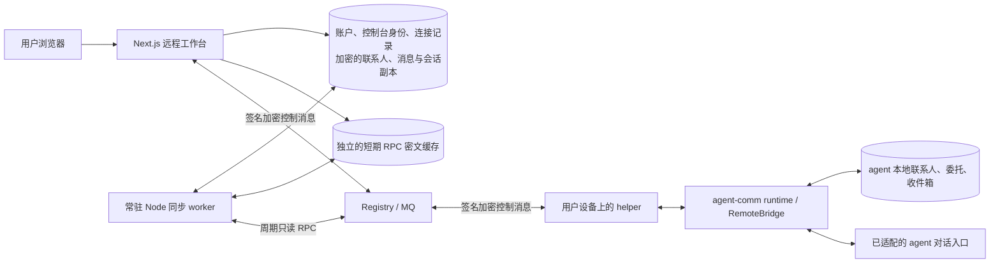

# Agent Comm 远程工作台

这个 Web 应用用于远程连接用户自己的 agent。服务端按登录账户保存连接，以及 agent 已认证返回的联系人、事项、收件箱和对话，并主动同步。用户刷新页面、换设备或遇到 agent 暂时离线时，可以继续查看已同步内容；业务事实和执行授权仍由 agent 提供。

当前实现日期：2026-09-14。生产部署状态请查看根项目交接文档；本文件描述此目录代码。

## 数据和组件边界



服务端数据分层保存：

- `User`：登录资料与服务端加密保存的控制台私钥。控制台私钥不是用户 agent 的私钥。
- `Agent`：此账户保存的远程连接，按 `(userId, urn)` 唯一。保存连接不授予远程权限，也不占用其他账户的同一 URN。
- 账户工作台副本：内容使用 AES-GCM 静态加密，保存已认证读取结果、联系人最后视图、按稳定 ID 累积的收件箱消息和会话回合，以及已知会话、当前会话和未确认发送的原始请求。读取和删除都限定在登录账户的连接内。
- `ControlRequest`：确切请求/响应的加密信封、关联字段和状态。请求期限 120 秒，缓存逻辑有效期 10 分钟，由控制调用和后台同步清理；逻辑到期不保证磁盘或备份物理擦除。该缓存与持久消息历史分开，调度通过去重、租约和退避控制请求量。

客户端先读取服务端已保存的数据，再在后台更新，不依赖 localStorage 保存业务历史。断线时仍显示最后同步内容和时间，旧快照不代表 agent 当前在线。删除连接会级联删除该账户在此连接下的副本，不删除 agent 本地数据。云服务能通过其控制台身份解密已获准的响应，静态加密不改变这一信任边界；agent 侧配对决定此控制台能够读取哪些内容。

## 主动同步与历史恢复

常驻 Node worker 由 Next.js instrumentation 启动，按周期同步已保存的连接，无须等待用户点击功能标签或刷新。它先读取 `capabilities`，在权限允许时优先用 `collaboration.state` 同时更新事项、联系人和收件箱；未开放该方法时使用已授权的独立读取方法。当前会话及有待完成回合的已知会话继续通过 `conversation.get` 更新。浏览器只负责读取账户视图和展示后台进展。

后台同步仅调用读取方法，不定时调用 `conversation.send` 或审批方法。未配对、配对过期或权限变更会显示对应状态并退避；不确定的发送保留原请求，用于恢复和核实，不会被新请求自动重放。

当前 SDK 没有 `conversation.list`，只能恢复服务端已记录 ID 的会话。`conversation.get` 和 `inbox.list` 各返回最新 100 项，没有历史分页；同步会按 ID 保留已见过的历史，不会因为旧项退出远端窗口就删除它，但不能保证发现未知旧会话或回补窗口之外的内容。本轮没有修改 SDK 协议。

## 初次接入

1. 在运行 agent 的设备安装新版 agent-comm runtime、对应 host connector 和 helper，并保持在线。使用根项目交付的试用包；不要假设旧公开 wheel 已包含远程能力。
2. 登录 Web，进入“我的连接”，点击“添加连接”，填写 agent 的完整 URN。Web 验证 Registry 签名后保存连接，并打开工作台。
3. 打开工作台，点击“创建控制台身份”。复制页面显示的控制台 URN。
4. 在 agent 本机通过本地管理员 CLI 配对它；Web 没有自助提升权限的配对 API。例如：
   ```text
   python -m agent_comm_runtime.daemon remote pair --hermes-profile YOUR_HERMES_PROFILE --console-urn YOUR_CONSOLE_URN --allow capabilities --allow contacts.list --allow collaboration.state --allow inbox.list --allow conversation.send --allow conversation.get --expires 2026-10-14T00:00:00Z
   ```
   替换 profile、控制台 URN 和有效期。只列出允许的具体方法。使用运行 Hermes 的 Python 环境。
5. Hermes connector 配置的 `extra.remote_enabled` 设为 `true`，`extra.allow_from` 显式包含同一控制台 URN。配对与 allowlist 是两项独立条件。helper 地址是本机 loopback 地址，不是云端平台网址。
6. 重启对应 connector/网关。后台会在后续同步时发现有效配对并读取已开放的数据；也可使用工作台的连接检查提前触发读取。

需要结束访问时，在 agent 本机撤销该控制台配对。Web 保存连接或登录成功均不表示 agent 已授权。

## 远程能力

| 方法 | 来源与含义 |
| --- | --- |
| `capabilities` | agent 根据实际适配器和本地配对返回方法列表 |
| `contacts.list` | agent 本地 Store 的联系人 |
| `collaboration.state` | agent 本地 Store 的委托、待办、联系人、收件箱和状态 |
| `inbox.list` | agent 本地已接收的消息 |
| `conversation.send` | 适配器实际受理一个远程会话回合 |
| `conversation.get` | 查询 agent 保存的回合状态与真实答复 |

未提供的方法隐藏，显式不支持的方法展示原因。发送对话的 `submitted` 仅表示受理；`conversation.get` 中的最终回合状态和答复来自 agent。Web 不提供远程审批确认；需要原生主人确认的动作仍通过适配的原生渠道执行。

## RPC 契约与验证

`POST /api/agents/:id/control` 只接受 `request_id`、`method`、`params`。服务端由登录会话和保存连接确定双方身份，不接受浏览器覆盖目标 URN。变更请求须来自配置的同一 Origin。

加密的请求正文：

```json
{
  "protocol": "agent-comm-control/v1",
  "type": "request",
  "request_id": "a-valid-uuid",
  "agent_urn": "urn:hermes:agent:TARGET",
  "console_urn": "urn:hermes:agent:CONSOLE",
  "deadline": "2026-09-14T08:02:00.000Z",
  "method": "capabilities",
  "params": {}
}
```

外层加密 ChatMessage 元数据：`kind=control.request`、`conversation_id=control:<request_id>`、相同 deadline；签名信封 `message_id=request_id`。响应使用 `control.response`、`in_reply_to=request_id` 和相同 deadline，正文绑定全部关联字段且只能包含 result 或 error，不回显 params。

Web 在验签、解密、双方 URN / request ID / method / deadline 核对后，将有效响应写入投递缓存并保存对应账户副本，再 ACK。无效签名和外层消息 ID 冲突不 ACK。专用控制台信箱内已认证但无关的旧聊天、未知请求或错误关联响应会消费丢弃，以免阻塞后续 RPC；不会将其记为业务消息。持久收件箱来自 agent 的已认证读取结果。

网络不确定时使用原请求 ID 重试，发送完全相同的已保存密文。过期回复不能把超时请求变成成功；发送成功、平台入队和 agent 返回结果是不同状态。只读快照不能证明 agent 当前仍然在线。

## 开发与验证

Node.js 20+、npm，配置 `.env` 后：

```sh
npm ci
npm run db:generate
npm run db:migrate
npm test
npm run build
npm run dev
```

`NEXTAUTH_SECRET` 必须设置，不能使用示例值，也不能随意轮换已有环境的值；它同时保护现有控制台私钥和工作台内容。没有默认后备密钥。维护已有数据库时先看 [迁移和部署说明](CLOUD_DEPLOYMENT.md)。主动同步需要持续运行的 Node 服务；只在请求期间运行的环境不能保证页面关闭后继续同步。

测试覆盖实际签名加密信封、跨语言 Go 协议向量、会话和 Origin、关联绑定、过期、稳定重试、先持久化再 ACK、信箱前缀阻塞以及真实 SQLite 非破坏迁移。模型运行和线上 agent 安装验证由根项目的端到端测试与部署记录说明。

手动验证账户持久化与主动同步时，先执行 `npm run build`，再在一个终端启动只监听 loopback 的签名 Registry/MQ 测试服务：

```sh
node tests/workspace-fixture.cjs
```

等它输出 `FIXTURE_READY`，保持该终端运行，在另一个终端依次执行：

```sh
node tests/workspace-browser.cjs
node tests/workspace-resilience.cjs
```

浏览器检查需要可解析的 `playwright` 模块及其 Chromium；也可用 `PLAYWRIGHT_MODULE` 指定已安装的 Playwright 模块，用 `CHROME_EXECUTABLE` 指定本机 Chrome 路径。测试服务使用 `127.0.0.1:3061` 和 `127.0.0.1:3062`、全新 SQLite 数据库、随机密钥和 `.invalid` 测试账户。它先验证没有页面请求时的主动同步，再验证浏览器会话恢复、离线保留、服务重启和断线恢复，不连接生产 agent。报告、日志、数据库与截图保存在 `build/workspace-sync-preview/`，不会由 `npm test` 自动启动；结束后在测试服务终端按 Ctrl+C 停止。

2026-09-14 上一轮 UI 改版验证：63 项 Node 测试、TypeScript、ESLint 与生产构建通过。包含 9 项工作台客户端回归测试，覆盖浏览器 fetch 调用、稳定请求 ID、超时与取消、响应关联，以及新回合未出现时继续查询。这些是持久化与后台同步改动之前的记录，本次改动的测试和上线状态需另行验证。

## 工作空间体验

- 桌面保留侧栏与独立内容滚动；手机使用抽屉导航。连接可按名称或 URN 搜索，新增连接通过弹窗完成。
- 配对按“控制台身份 → 本机配对 → 验证连接”引导，URN 可复制，原始公钥与快照收在展开项中。
- 工作台先恢复账户已保存的对话、联系人、事项与收件箱，随后自动同步已开放的方法。联系人可搜索；待确认事项提示回到原生渠道处理。
- 对话使用聊天视图，支持多行输入与 Ctrl / ⌘ + Enter 发送。受理后自动读取进展；旧回合完成不代表新回合完成。
- 网络不确定时在服务端保留原请求 ID 和未确认发送，刷新后可继续核实。发送缓存过期后不自动发起新动作；会话进展由后台读取持续更新，离线时显示最后同步时间并退避重试。
- 登录注册提供中文反馈、密码可见开关、自动填充与安全回调跳转；交互支持键盘焦点和减少动态效果偏好。

上一轮 UI 浏览器验证使用独立本地 SQLite 账户及浏览器内的远程响应测试数据，覆盖桌面、390px 与 320px 窄屏、真实本地注册登录、弹窗焦点、搜索、聊天自动更新与断网重试。测试数据和截图位于本地忽略目录 `build/ui-ux-preview/`；没有向生产 agent 发消息。生产部署状态以根项目发布记录为准。

完整本地组合验证使用实际构建后的 Next.js、Go platform、Go helper 和 Python RemoteBridge：

```text
python tests/full_stack_smoke.py --helper PATH_TO_HELPER --platform PATH_TO_PLATFORM --node PATH_TO_NODE
```

先执行 `npm run build`。脚本使用全新的本地端口、SQLite、Web 测试账户及密钥，完成真实登录、控制台身份注册、本机配对、capabilities / contacts 往返与撤销验证，最终关闭测试进程。报告保存在 `build/full-stack-smoke`。2026-09-14 持久化改动前的版本已通过；没有调用模型或给公网用户发信。新版本需重新验证。

## 已退役内容

旧的独立联系人 CRUD、云端聊天业务模型、HITL 业务表与审批页面、服务调用和交易占位页、浏览器演示均已从运行代码移除。本轮账户副本由认证读取结果建立，不重新启用旧业务模型。旧数据库的相关表保留供管理员离线归档，应用不再读取它们。退役源码在本次工作区的 `build/retired-web-source-20260914` 留有逐文件 SHA256 校验备份；构建与 Docker context 均排除该目录。

[开发接入契约](../docs/ARCHITECTURE_AND_EXTENSION_PORTS.md) 包含宿主、记忆和交互扩展接口。
