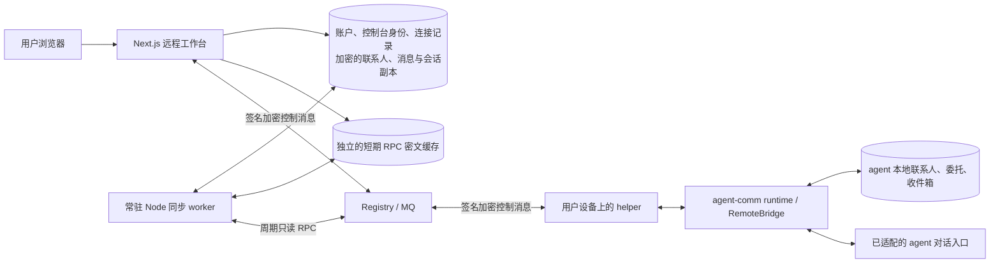

# Web 技术参考：架构、接入与验证

[返回使用介绍](../../README.md)。本文面向需要安装、维护或开发工作台的读者。命令均在 Web 项目根目录执行（agent 本机命令除外）。

这个 Web 应用用于远程连接用户自己的 agent。服务端按登录账户保存连接，以及 agent 已认证返回的联系人、事项、收件箱和对话，并主动同步。用户刷新页面、换设备或遇到 agent 暂时离线时，可以继续查看已同步内容；业务事实和执行授权仍由 agent 提供。

本文描述当前源码；生产部署版本以部署仓库固定的提交及发布记录为准。

## 数据和组件边界



服务端数据分层保存：

- `User`：登录资料与服务端加密保存的控制台私钥。控制台私钥不是用户 agent 的私钥。
- `Agent`：此账户保存的远程连接，按 `(userId, urn)` 唯一。保存连接不授予远程权限，也不占用其他账户的同一 URN。
- 账户工作台副本：内容使用 AES-GCM 静态加密，保存已认证读取结果、联系人最后视图、按稳定 ID 累积的收件箱消息和会话回合，以及已知会话、当前会话和未确认发送的原始请求。读取和删除都限定在登录账户的连接内。
- `ControlRequest`：确切请求/响应的加密信封、关联字段和状态。请求期限 120 秒，缓存逻辑有效期 10 分钟，由控制调用和后台同步清理；逻辑到期不保证磁盘或备份物理擦除。该缓存与持久消息历史分开，调度通过去重、租约和退避控制请求量。

客户端先读取服务端已保存的数据，再在后台更新，不依赖 localStorage 保存业务历史。断线时仍显示最后同步内容和时间，旧快照不代表 agent 当前在线。删除连接会级联删除该账户在此连接下的副本，不删除 agent 本地数据。云服务能通过其控制台身份解密已获准的响应，静态加密不改变这一信任边界；agent 侧配对决定此控制台能够读取哪些内容。

### v2 策略与托管控制台边界

Web 的远程控制消息仍使用已配对的 v1 控制台身份，属于**托管端点可见**的消息；它们不是 Agent ↔ Agent 的 v2 隐私信封，也不能标为“合规网关已解密”。Web 另有独立的 TypeScript v2 规范 JSON、签名策略、握手帧、HPKE 信封和准入回执实现，供 v2 客户端接入与 Go 测试向量校验；当前工作台控制流程尚未切换到 v2 会话。

连接 v2 Platform 时，Web 从 `/api/v2/policy` 取得原始已签策略，用独立配置的策略根公钥和平台 ID 验证，并在 `PlatformPolicyState` 持久记录已见最高 epoch。策略过期、签名错误或回退时，控制消息停止发送。合规策略不允许全局 v1；Web 使用策略指定的托管发行者签发一小时控制台证书，经控制台私钥证明持有身份后登记到 `/api/v2/managed/identity`。登记成功的证书保存在 `ManagedConsoleCertificate`，到期前续签。平台登记丢失时，Web 重新登记一次并重发同一原始信封。此例外只允许已认证的托管控制台继续 v1 控制流，不改变 Agent ↔ Agent 路由的 v2 准入要求；已入队的旧 v1 消息也不会因后来登记而追溯获得准入。旧 Platform 没有 v2 策略端点且未配置 v2 信任根时，保留原 v1 流程。

Dashboard 和一次性连接授权页展示当前**已验签**策略的模式、epoch、平台 ID 和内容可见范围。隐私政策表示符合 v2 的 Agent ↔ Agent 私密消息不向网关提供内容密钥；合规政策表示这类消息必须提供网关可解密密钥槽。该展示只说明平台政策，不证明任一实际 Agent 消息已经采用 v2。工作台始终另行说明：Web 服务可解密已授权的托管控制响应及账户副本。

合规政策下，每个 Web 账户要先在浏览器勾选披露内容并提交当前策略哈希。`UserPolicyConsent` 保存账户、平台、epoch、完整签名策略哈希、网关密钥 ID 和确认时间；新 epoch 或策略内容变化不能沿用旧确认。用户可以随时点击“暂停后续远程控制与同步”，`UserControlPause` 持久记录账户暂停状态，跨策略变化保持有效；同一合规策略可显式恢复，新合规策略需重新确认。暂停或确认前仍可登录、查看原有连接和已保存历史、退出；新的控制 MQ 收发、后台同步请求、控制台身份注册及一次性连接授权被服务端拒绝。策略无法验签、已过期、回退或端点故障时也停止这些操作；Web 不会因更新重置控制台身份、Agent 身份、既有配对或账户副本。暂停不能收回已披露内容。停止 Agent 向合规网关披露，应在 Agent 本机按已安装版本说明运行 `v2-disallow-compliance`；撤销 Web 访问则应撤销本机控制台配对，两者互不替代。Web 确认仅表示账户看过披露，Agent 本机是否允许合规 v2 仍由 Agent 自身配置决定。

现有工作台控制 RPC 无法仅靠切换 HTTP 路径升级为 v2：它使用 protobuf v1 信封和 `agent-comm-control/v1` 内容、Agent 端 RemoteBridge 的 v1 消费路径，且 Web 没有 v2 双向握手、会话序号、密钥轮换、回执持久化与响应关联。真正迁移需要 Web 与 Agent/helper 同时改用 v2 握手和 JSON 正文，并对旧配对、在途 v1 请求及旧回执制定兼容窗口。当前的受管证书仅维持明确标示的 Web 控制端点兼容，不能用作 Agent ↔ Agent v2 隐私或合规证明。

## 主动同步与历史恢复

常驻 Node worker 由 Next.js instrumentation 启动，按周期同步已保存的连接，无须等待用户点击功能标签或刷新。它先读取 `capabilities`，在权限允许时优先用 `collaboration.state` 同时更新事项、联系人和收件箱；未开放该方法时使用已授权的独立读取方法。当前会话及有待完成回合的已知会话继续通过 `conversation.get` 更新。浏览器只负责读取账户视图和展示后台进展。

后台同步仅调用读取方法，不定时调用 `conversation.send` 或审批方法。未配对、配对过期或权限变更会显示对应状态并退避；不确定的发送保留原请求，用于恢复和核实，不会被新请求自动重放。

worker 会在读取 Registry 或 MQ 前核验当前政策与账户确认。待确认或用户暂停显示 `policy_paused`；签名政策不可用或托管证书故障显示 `policy_unavailable`。两者保留旧快照和已有在途请求，不会显示“需要重新配对”；只有缺少控制台身份、Registry 未注册或 Agent 明确返回配对错误才进入 `needs_pairing`。用户确认或恢复后立即唤醒已有连接，并先重新检查 `capabilities`。

当前 SDK 没有 `conversation.list`，只能恢复服务端已记录 ID 的会话。`conversation.get` 和 `inbox.list` 各返回最新 100 项，没有历史分页；同步会按 ID 保留已见过的历史，不会因为旧项退出远端窗口就删除它，但不能保证发现未知旧会话或回补窗口之外的内容。

## 首次接入与已有安装的手工管理

普通用户首次接入以 Hermes 提供的一次性网页授权链接为主：在运行 Hermes 的设备安装完整接入包，由本机程序发起申请；用户登录后打开 `/connect/{code}`，核对 agent、功能范围和期限并确认，本机程序完成配对，工作台随后出现连接。现行用户步骤见[Web 使用介绍](../../README.md)。以下手工路线供已有安装、管理员维护或需要显式管理配对的人使用；它不是首次接入的必经操作。

1. 在运行 agent 的设备安装新版 agent-comm runtime、对应 host connector 和 helper，并保持在线。使用根项目交付的试用包；不要假设旧公开 wheel 已包含远程能力。
2. 登录 Web，进入“我的连接”，点击“添加连接”，填写 agent 的完整 URN。Web 验证 Registry 签名后保存连接，并打开工作台。
3. 首次打开工作台时自动创建控制台身份；失败可重试。复制页面显示的本机绑定命令或控制台 URN。
4. 在 agent 本机通过本地管理员 CLI 配对它；Web 没有自助提升权限的配对 API。例如：
   ```text
   python -m agent_comm_runtime.daemon remote pair --hermes-profile YOUR_HERMES_PROFILE --console-urn YOUR_CONSOLE_URN --allow capabilities --allow contacts.list --allow contacts.add --allow contacts.requests --allow contacts.respond --allow messages.send --allow inbox.mark_read --allow collaboration.execute --allow collaboration.state --allow inbox.list --allow attention.list --allow approval.respond --allow conversation.send --allow conversation.get --expires FUTURE_UTC_EXPIRY
   ```
   替换 profile、控制台 URN 和未来的 RFC3339 有效期（如 `YYYY-MM-DDTHH:MM:SSZ`）。只列出允许的具体方法；若不允许 Web 添加联系人或回答审批，分别省略 `contacts.add` 或 `approval.respond`。使用运行 Hermes 的 Python 环境。旧配对不会自动增加这些权限，需显式重配并保留仍需使用的全部方法。安装包的新版配置脚本通过 `--allow-web-actions` 显式追加社交写操作与协作工具，详见根仓库的配对说明。
5. Hermes connector 配置的 `extra.remote_enabled` 设为 `true`，`extra.allow_from` 显式包含同一控制台 URN。配对与 allowlist 是两项独立条件。helper 地址是本机 loopback 地址，不是云端平台网址。
6. 重启对应 connector/网关。后台会在后续同步时发现有效配对并读取已开放的数据；也可使用工作台的连接检查提前触发读取。

需要结束访问时，在 agent 本机撤销该控制台配对。Web 保存连接或登录成功均不表示 agent 已授权。

## 远程能力

| 方法 | 来源与含义 |
| --- | --- |
| `capabilities` | agent 根据实际适配器和本地配对返回方法列表 |
| `contacts.list` | agent 本地 Store 的联系人 |
| `contacts.add` | 用户提交稳定 ID、别名和 URN，本机记录并排队好友请求；实际投递和对端接受是后续阶段 |
| `contacts.requests` / `contacts.respond` | 查看与接受/拒绝好友请求 |
| `messages.send` / `inbox.mark_read` | 本机发消息及记录跨端已读 |
| `collaboration.execute` | 使用本机 Runtime 同一协作动作，describe 返回表单字段 |
| `collaboration.state` | agent 本地 Store 的委托、待办、联系人、收件箱和状态 |
| `inbox.list` | agent 本地已接收的消息 |
| `attention.list` | agent 本地持久、分页的提醒记录 |
| `approval.respond` | 用户同意或拒绝 agent 生成的具体待确认请求，由 agent 保存决定 |
| `conversation.send` | 适配器实际受理一个远程会话回合 |
| `conversation.get` | 查询 agent 保存的回合状态与真实答复 |

未提供的方法隐藏，显式不支持的方法展示原因。发送对话的 `submitted` 仅表示受理；`conversation.get` 中的最终回合状态和答复来自 agent。新增联系人与审批回答分别受 `contacts.add` 和 `approval.respond` 配对权限约束，不能由远程对话权限推导。

`contacts.add` 接受 `{contact_id, aliases, urn}`，表单提交只让 agent 记录主人指定的联系人 URN 并把好友请求排入本机持久队列；返回的 `requested` 与 `connection_status=pending` 都不证明 helper 已接收或对方已收到。已拒绝的联系人可从其卡片明确重新申请：用户再次核对 URN 并点击确认后，Web 沿用原 `contact_id`、`aliases` 和 `urn`，Agent 核对当前状态，若仍无在途请求且未连接才生成独立的新好友请求，并保留旧请求的拒绝结果；不能通过“添加另一位联系人”给同一 URN 创建第二条联系人。结果不明确时，Web 保留原 RPC 请求 ID 供显式重试，不能仅凭已存在的联系人记录或其他端的新好友请求推断本次重发成功；需要同一 RPC 请求 ID 的权威回执。当前公开 v0.8.0 helper 仍要求双方通过独立渠道核对并固定对方完整 Ed25519 公钥，Web 不能代为固定；更新后的单 Platform 源码可按准确 URN 自动验证公钥。自动验钥只能证明该 URN 的密钥持有者，不能确认现实人物身份。未知 URN 的申请交收件主人接受或拒绝；仅接受后 `connection_status` 才会变为 `connected`，允许发送普通消息，但不会自动提高 `trusted` 或授予协作、工作台及合规披露权限。`approval.respond` 接受 `{approval_id, decision: "approve" | "deny"}`；审批内容来自 agent，Web 无法覆盖主人主体或提交任意批准内容。Agent 从已验证控制台的本地配对导出主人身份，并检查请求、事项、内容版本与期限；批准只更新授权/审批状态，不直接发送业务消息。写操作均通过用户操作触发，后台同步仍只读取；联系人与审批事实继续通过 agent 的已认证读取结果保存到账户副本。

此新增能力需要发布匹配的 Agent/runtime 和 Web；仓库文档更新不代表线上服务或公开安装包已包含。

## RPC 契约与验证

`POST /api/agents/:id/control` 只接受 `request_id`、`method`、`params`。服务端由登录会话和保存连接确定双方身份，不接受浏览器覆盖目标 URN。变更请求须来自配置的同一 Origin。

加密的请求正文：

```json
{
  "protocol": "agent-comm-control/v1",
  "type": "request",
  "request_id": "a-valid-uuid",
  "agent_urn": "urn:hermes:agent:TARGET",
  "console_urn": "urn:hermes:agent:CONSOLE",
  "deadline": "2026-09-14T08:02:00.000Z",
  "method": "capabilities",
  "params": {}
}
```

外层加密 ChatMessage 元数据：`kind=control.request`、`conversation_id=control:<request_id>`、相同 deadline；签名信封 `message_id=request_id`。响应使用 `control.response`、`in_reply_to=request_id` 和相同 deadline，正文绑定全部关联字段且只能包含 result 或 error，不回显 params。

Web 在验签、解密、双方 URN / request ID / method / deadline 核对后，将有效响应写入投递缓存并保存对应账户副本，再 ACK。无效签名和外层消息 ID 冲突不 ACK。专用控制台信箱内已认证但无关的旧聊天、未知请求或错误关联响应会消费丢弃，以免阻塞后续 RPC；不会将其记为业务消息。持久收件箱来自 agent 的已认证读取结果。

网络不确定时使用原请求 ID 重试，发送完全相同的已保存密文。过期回复不能把超时请求变成成功；发送成功、平台入队和 agent 返回结果是不同状态。只读快照不能证明 agent 当前仍然在线。

## 开发与验证

Node.js 20+、npm，配置 `.env` 后：

```sh
npm ci
npm run db:generate
npm run db:migrate
npm test
npm run build
npm run dev
```

`NEXTAUTH_SECRET` 必须设置，不能使用示例值，也不能随意轮换已有环境的值；它同时保护现有控制台私钥和工作台内容。没有默认后备密钥。维护已有数据库时先看 [迁移和部署说明](../operations/DEPLOYMENT.md)。主动同步需要持续运行的 Node 服务；只在请求期间运行的环境不能保证页面关闭后继续同步。

测试覆盖实际签名加密信封、跨语言 Go 协议向量、会话和 Origin、关联绑定、过期、稳定重试、先持久化再 ACK、信箱前缀阻塞以及真实 SQLite 非破坏迁移。模型运行和线上 agent 安装验证由根项目的端到端测试与部署记录说明。
v2 单元测试还用 Go 生成的固定向量核对策略、HPKE 解封、正文、回执及托管证书的规范字节与签名；Web 工作台的现行控制往返仍按 v1 的端到端检查验收。

手动验证账户持久化与主动同步时，先执行 `npm run build`，再在一个终端启动只监听 loopback 的签名 Registry/MQ 测试服务：

```sh
node tests/integration/workspace-fixture.cjs
```

等它输出 `FIXTURE_READY`，保持该终端运行，在另一个终端依次执行：

```sh
node tests/integration/workspace-browser.cjs
node tests/integration/workspace-resilience.cjs
```

浏览器检查需要可解析的 `playwright` 模块及其 Chromium；也可用 `PLAYWRIGHT_MODULE` 指定已安装的 Playwright 模块，用 `CHROME_EXECUTABLE` 指定本机 Chrome 路径。测试服务使用 `127.0.0.1:3061` 和 `127.0.0.1:3062`、全新 SQLite 数据库、随机密钥和 `.invalid` 测试账户。它先验证没有页面请求时的主动同步，再验证浏览器会话恢复、离线保留、服务重启和断线恢复，不连接生产 agent。报告、日志、数据库与截图保存在 `build/workspace-sync-preview/`，不会由 `npm test` 自动启动；结束后在测试服务终端按 Ctrl+C 停止。


## 工作空间体验

- 官网 `/`、文档 `/docs/`、账户页和工作台现由同一个 Next.js 应用提供。官网与文档共用公开导航，工作台可直接返回首页和文档；登录后进入工作台的账户导航仍保留原有状态。文档的 `?path=...` 分享地址继续读取四仓现行 Markdown，部署 nginx 仍限定公开文件；Next.js 也按同一白名单提供只读原文，供本地开发与直接访问 Web 使用。
- 官网首屏保留用途、主要能力与 Hermes 三步接入；四个项目的分工、完整接入提示和下载包版本信息通过展开项查看，复制接入说明按钮仍直接可用。FAQ 默认收起，安装指南、下载清单和授权边界链接保持可访问。
- 桌面保留侧栏与独立内容滚动；手机使用抽屉导航。连接可按名称或 URN 搜索，新增连接通过弹窗完成。
- 配对按“控制台身份 → 本机配对 → 验证连接”引导，URN 可复制，原始公钥与快照收在展开项中。
- 工作台先恢复账户已保存的对话、联系人、事项与收件箱，随后自动同步已开放的方法。联系人可搜索并展示短期在线状态；好友请求可接受/拒绝；消息可发送和标记已读，收件箱每条消息展示并可复制完整消息 ID，已读按钮的辅助阅读名称也包含该 ID；授权可通过网页或原生渠道处理。
- 对话使用聊天视图，支持多行输入与 Ctrl / ⌘ + Enter 发送。受理后自动读取进展；旧回合完成不代表新回合完成。
- 网络不确定时在服务端保留原请求 ID 和未确认发送，刷新后可继续核实。发送缓存过期后不自动发起新动作；会话进展由后台读取持续更新，离线时显示最后同步时间并退避重试。
- 登录注册提供中文反馈、密码可见开关、自动填充与安全回调跳转；交互支持键盘焦点和减少动态效果偏好。
- 政策披露在需要确认或阻止控制时显示完整操作；正常状态先给简要说明，详细模式、epoch 和可见范围可展开。提醒中心优先显示需处理和未读内容，已处理记录与设备通知设置按需展开。事项和联系人列表先给摘要，再展开单条细节及可执行操作；状态和授权限制仍按真实结果显示。


完整本地组合验证使用实际构建后的 Next.js、Go platform、Go helper 和 Python RemoteBridge：

```text
python tests/integration/full_stack_smoke.py --helper PATH_TO_HELPER --platform PATH_TO_PLATFORM --node PATH_TO_NODE
```

先执行 `npm run build`。脚本使用全新的本地端口、SQLite、Web 测试账户及密钥，完成真实登录、控制台身份注册、本机配对、capabilities / contacts 往返与撤销验证，最终关闭测试进程。报告保存在 `build/full-stack-smoke`。它不调用模型或向公网用户发信。

## 已退役内容

旧的独立联系人 CRUD、云端聊天业务模型、HITL 业务表与审批页面、服务调用和交易占位页、浏览器演示均已从运行代码移除。账户副本由认证读取结果建立，不重新启用旧业务模型。旧数据库的相关表保留供管理员离线归档，应用不再读取它们。退役源码可从 Git 历史检索；当前源码不依赖开发者本机备份目录。

[开发接入契约](https://github.com/BillShiyaoZhang/agent-collaboration-deploy/blob/main/docs/architecture/OVERVIEW.md) 包含宿主、记忆和交互扩展接口。

## 多端共享契约

工作台的协议类型、稳定请求 ID 与轮询客户端、快照/回合合并、能力与配对校验、只读同步计划已拆到独立 npm workspace [@agent-comm/client-contract](../../packages/client-contract/README.md)。Web UI、API 校验和后台同步使用同一模块；模块无需 React、Next.js、Prisma 或 Node crypto，也可单独打包给其他 JavaScript 客户端。Swift/Kotlin 等客户端使用相邻 JSON Schema 和跨语言 fixtures 对齐字段、时间单位、分页及不确定发送语义。

新增 npm workspace 后应执行 `npm ci`。Docker 的依赖阶段已包含本地包。`npm test` 同时运行共享包 conformance 测试；`npm run test:contract` 可单独检查。身份认证、数据库加密、信封验签/传输仍保留在对应平台实现中。

跨端重试现在使用规范化 JSON 比较，同时兼容已存在的 10 分钟投递缓存中两种有效会话参数顺序，保留原密文与请求期限。该服务端兼容修复需要重新构建并发布 Web 服务后才会在线生效；不需要清库或更换身份密钥。详细上线边界见[共享模块的重试与发布说明](../../packages/client-contract/README.md#cross-client-retries-and-rollout)。


## 会话管理与持久操作账本

工作台的会话库只列出此账户在当前连接中已保存的会话。可以修改主题、归档或恢复会话，保存每段会话的输入草稿与阅读位置。归档改变 Web 列表，不删除 agent 记录，也不解除协作待办。WorkspaceConversationState 是独立追加表，标题、草稿、阅读位置、归档和已看时间使用同样的账户/连接/记录绑定加密。空 conversationId 对应尚未创建的新对话草稿。后台重复读取相同回合不会产生新的会话活动时间；真实新回合、处理状态或回复变化才更新列表。

历史搜索在服务端解密**当前账户、当前连接已保存的回合**，匹配主题、用户文本或 agent 答复。它不查询其他账户、不搜索草稿或未确认的本地发送，也不向 agent 发起全部历史发现。返回 scope 为 saved_account_history，不能把结果表述为完整的 agent 历史。标题与正文没有明文全文索引；很大规模的保存历史仍需评估解密搜索成本。

联系人添加/回应、发消息、标已读、审批回应及 collaboration.execute 的原请求保存在 WorkspaceOperation。原始 PendingCall、显示阶段、认证结果和创建/更新时间采用静态加密；索引仅含请求 ID、方法及阶段等调度信息。服务端控制调用在编码和投递前保存原请求，即使绕过浏览器流程也不能跳过账本。已保存的请求 ID 不能改变方法或参数；账本不会因 10 分钟 RPC 缓存清理而消失，也不会延长原 120 秒投递期限。已终态或已过期的原 ID 不能生成新的投递信封。

客户端恢复账本只读取内容，不自动重放写请求。期限内明确重试使用原 ID、参数和持久 wire；未知 collaboration.execute 不通过新 ID 重新执行。只有审批回应、好友请求回应、标已读，以及带原稳定 message_id 的消息发送，可由本人在核实后对同一确切对象明确重新操作，旧原请求仍留在账本。未知联系人添加不能通用重启：原申请可能已被拒绝，换 RPC ID 会创建另一条申请；确认要重新申请时使用专门入口。旧消息发送缺少稳定 message_id 时也不能重启。认证响应或确切的认证对象事实可以结算阶段；浏览器提交的成功提示不能写入 succeeded 或伪造业务结果。旧版 sessionStorage 待确认记录首次打开时导入为已过期的 uncertain，缺少可信投递期限时禁止恢复投递。

### 账户接口

以下接口均从登录会话取得账户；写入要求配置的同源 Origin，响应使用 private, no-store。保存状态和查看账本不授予新 agent 权限。

| 接口 | 请求 | 返回 / 含义 |
| --- | --- | --- |
| GET /api/agents/:id/workspace/conversations | 可选 q、archived（active/archived/all）、before 会话 ID、limit（1..50） | items、before、hasMore、scope；每项含归档、已看时间、未读和可选命中回合/片段 |
| POST /api/agents/:id/workspace/conversations | conversationId（字符串或 null）、可选 title、archived、readAt、draft、scrollTop | state；部分字段更新，已看时间不回退、不接受未来阅读时间 |
| GET /api/agents/:id/workspace/operations | 无 | items；所有未确认原请求及最近已终态记录 |
| POST /api/agents/:id/workspace/operations | action=reserve、call、可选 reusedContact、conversationId | item；原请求持久化后才可发送 |
| 同上 | action=update、requestId、phase、可选 message、retryable | 仅保守显示提示；认证阶段和结果不接受浏览器覆盖 |
| 同上 | action=import_legacy、call、可选 reusedContact | 导入旧浏览器原记录，已过期且不可写重试 |

常规 /workspace 账户快照同时返回 operations 与 activeConversationState。前者不替代 agent 的事项/联系人真相源；后者不替代 agent 来信已读。阅读当前会话可以更新 Web 已看时间以及对应对话结果通知的已读版本，仍保留未解决的本人审批与恢复待办。

### 普通对话结果通知

从认证 conversation.get 的新完成、失败或中断回合生成 conversation_completed / conversation_failed 提醒；中断摘要明确执行结果尚不确定，保留原请求核实，不自动重发。首次导入的历史结果不会批量产生系统弹窗；之前见过的处理中回合转为终态或之后出现的新结果，才具备系统通知资格。未认证的超时、本地中断或单纯提交回执不能生成完成提醒。

目标包含 kind=conversation、id=conversation_id、turn_id。原生 attention.list 返回同一目标时与 Web 兼容投影归并，并保留阅读版本；提醒深链可回到正确会话与回合。结果提醒不计为待操作，回合完成也不证明其业务目标完成。读取动作、普通等待和 ACK 不产生新的结果提醒。

明确 `collaboration.execute` 的 `action=describe` 只读取功能说明，不计入业务操作账本。旧版本已保存的说明记录仍保留在加密审计中，恢复列表不将它当成未知业务写入；所有真实未知协作写入继续保留。草稿的本地缓存只有未获服务端确认的编辑可以覆盖新服务端值，保存确认按本地版本匹配；异步读取跨过编辑或保存时不更新编辑框。
